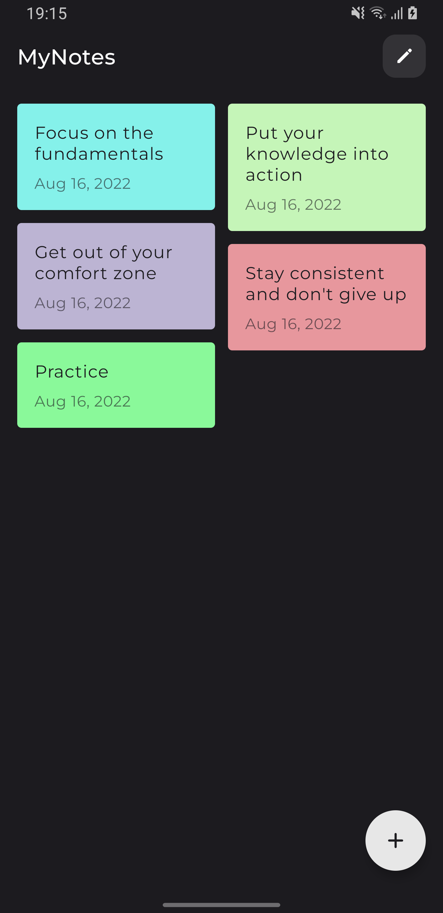
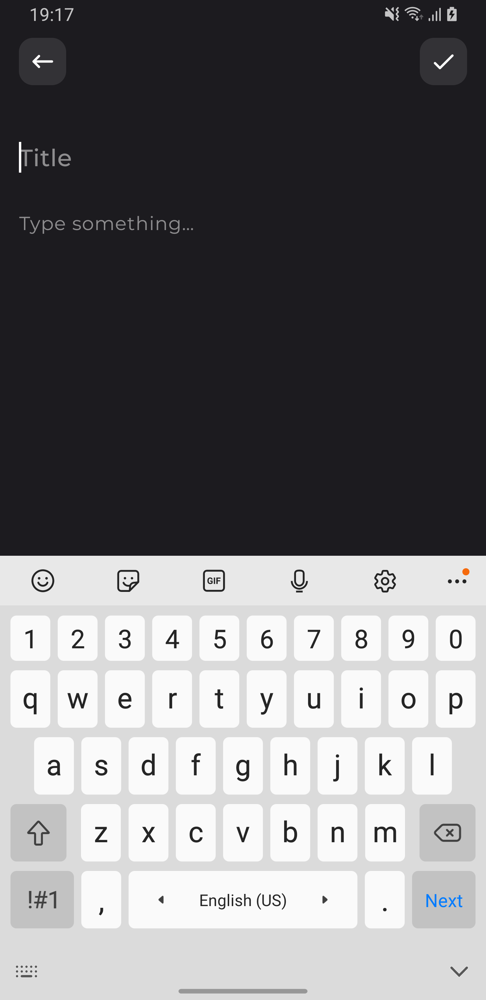
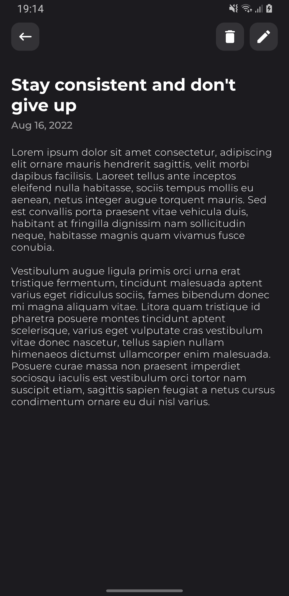
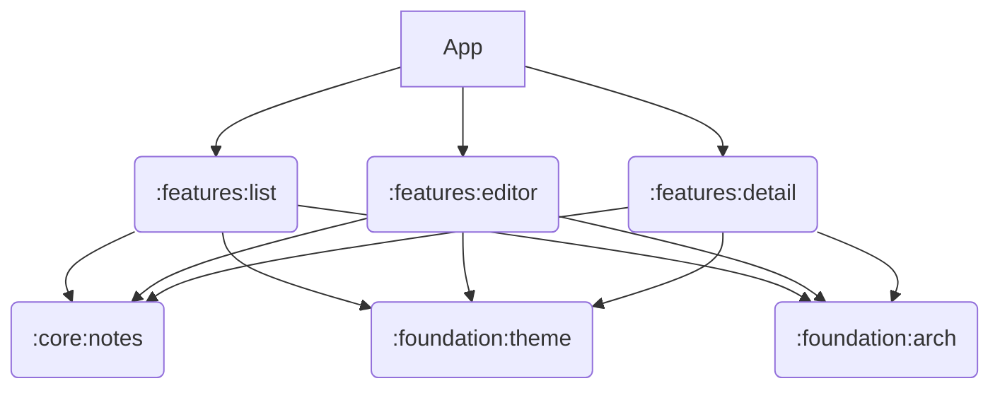

My Notes
==================

Fully functional Android app built entirely with Kotlin and Jetpack Compose.

## Features

| List | Editor | Detail |
| ----------- | ----------- | ----------- |
|  |  |  |

## Tech stack
* [Jetpack Compose](https://developer.android.com/jetpack/compose) Android’s modern toolkit for building native UI
* [Hilt](https://developer.android.com/training/dependency-injection/hilt-android) Dependency injection library
* [Sqldelight](https://cashapp.github.io/sqldelight/) For generating typesafe Kotlin APIs from SQL statements
* [Accompanist](https://google.github.io/accompanist/) libraries

# Architecture
MVI (TBA)

# Modularization
